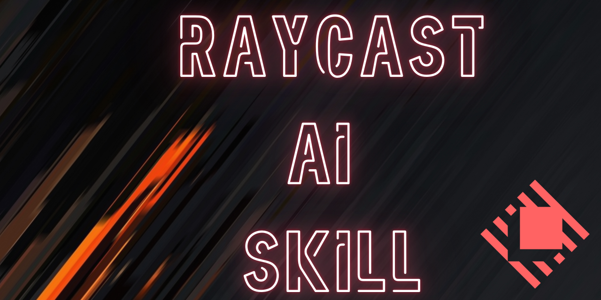

# 🔍✨ Raycast Agentic Skill



> A free skill file that teaches your AI coding assistant how to build Raycast commands and extensions the right way, the first time.

[](LICENSE.txt) [](https://developers.raycast.com/) [](https://github.com/adriangrantdotorg/Raycast-AI-Skill/releases) [](https://github.com/anthropics/skills) [](https://github.com/adriangrantdotorg/Raycast-AI-Skill/pulls)

---

## ⬇️ Why Install?

- ⏱️ **Less time per command** — it gets things right on the first try
- 💸 **$0 added cost** — it rides on the AI you already pay for
- 📅 **Current with Raycast 2.7** — not the AI's year-old memory

| | 😩 Without this Skill | 😌 With this Skill |
| --- | :---: | :---: |
| 🔁 Tries until it works | 🧪 3–5 | **1** |
| 📄 Code for a simple hotkey | 🧪 ~200 lines | **~10 lines** |
| 🛠️ Build steps | `npm install` + build | **none** |
| 🪙 AI usage burned on retries | 🧪 ~4× | **1×** |

<sub>🧪 estimate</sub>

---

## ✨ Features

Before writing code, the AI picks the lightest option that works: a built-in Quicklink or Snippet, a one-file Script Command, or a full Extension.


- 📜 **Script Commands that don't hang** — every `@raycast.*` setting right, including traps like a hidden SSH password prompt
- 🎨 **Extensions that feel native** — keyboard-driven lists, self-closing forms, menu bar items, background refresh
- ⚡ **Instant, flicker-free data** — the right `@raycast/utils` hook for each job
- 🔐 **Secure tokens and sign-in** — encrypted preferences and built-in OAuth for GitHub, Linear and Slack
- 🤖 **Raycast AI tools** — tools Raycast AI can call for you ("@contacts find…"), with evals
- 🩺 **Debugging that finds the real error** — reads Raycast's own logs, like a dev extension dropped after the v2 upgrade
- 📚 **Exact API facts on hand** — four reference files the AI checks before guessing a prop name

---

## 🚀 Installation

Needs **[Raycast](https://www.raycast.com/)** and an AI assistant that supports [Agent Skills](https://github.com/anthropics/skills). Full Extensions also need **[Node.js](https://nodejs.org/)** 22.22.2+.

Keep the folder named `raycast`; tools skip a skill whose folder name doesn't match. Raycast AI also reads skills from `~/.claude/skills/`.

---

```bash
git clone https://github.com/adriangrantdotorg/Raycast-AI-Skill.git /tmp/Raycast-AI-Skill
cp -R /tmp/Raycast-AI-Skill/skills/raycast ~/.claude/skills/raycast   # Claude Code
cp -R /tmp/Raycast-AI-Skill/skills/raycast ~/.cursor/skills/raycast   # Cursor
cp -R /tmp/Raycast-AI-Skill/skills/raycast ~/.agents/skills/raycast   # ChatGPT & Codex
```

| **Platform** | **Skills folder** |
| --- | --- |
| **[Claude Code](https://code.claude.com/docs/en/skills)** | `~/.claude/skills/` |
| **[Cursor](https://cursor.com/docs/skills)** | `~/.cursor/skills/` |
| **[ChatGPT & Codex](https://learn.chatgpt.com/docs/build-skills)** | `~/.agents/skills/` |

## 💡 Usage

Describe what you want; the skill kicks in on its own.

| You Say | The Skill creates |
| --- | --- |
| "Make a Raycast command that wakes my Mac Mini over the network." | A **Script Command** in silent mode that shows a clear error toast if it fails |
| "Build a Raycast extension that adds a task to my Notion database, with a tag picker." | An **Extension** with the token stored securely, cached tags, and a form that closes when saved |
| "My extensions disappeared after updating to Raycast 2." | A **fix**: finds the dropped ones in Raycast's logs and re-imports each |

---

<div align="center">
  <sub>Built with ❤️ for the Raycast community</sub>
</div>
